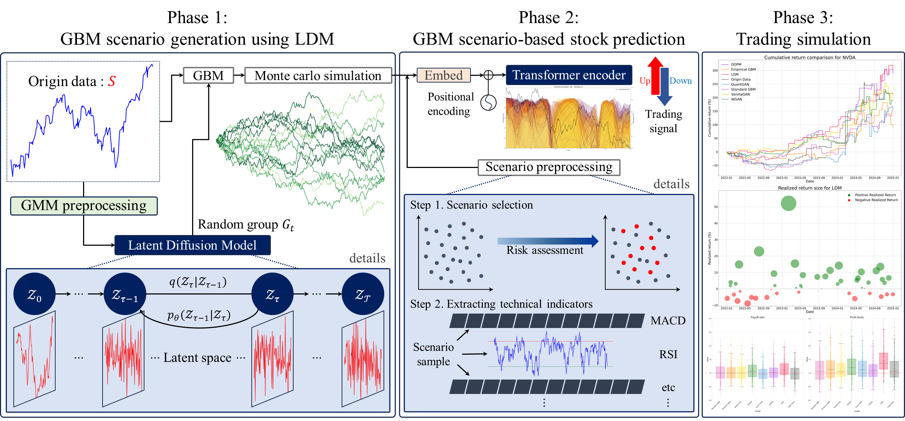
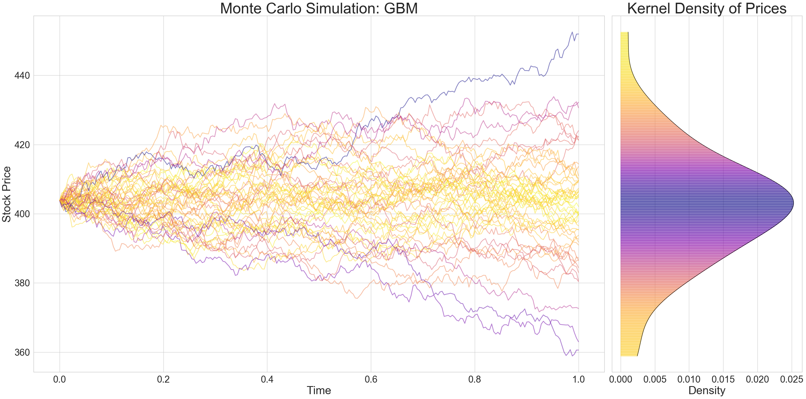
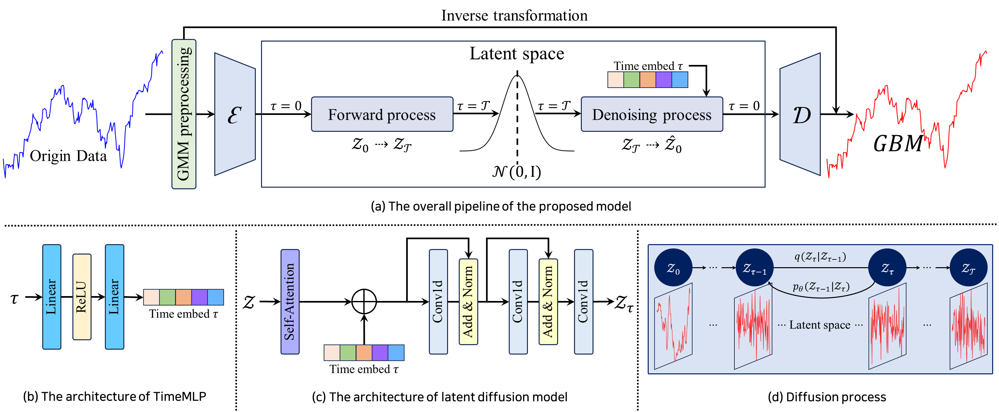
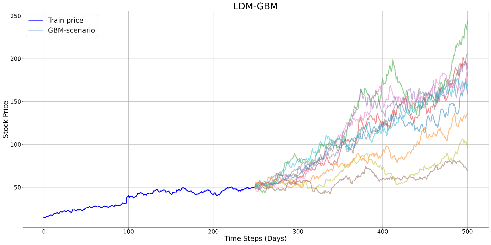
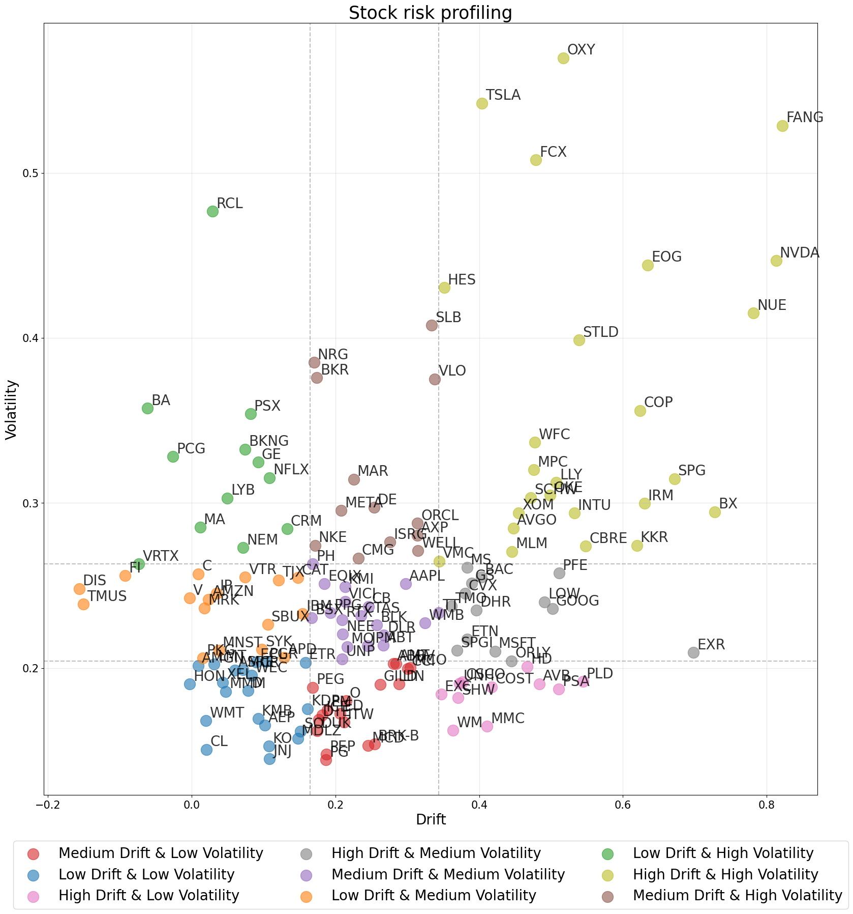
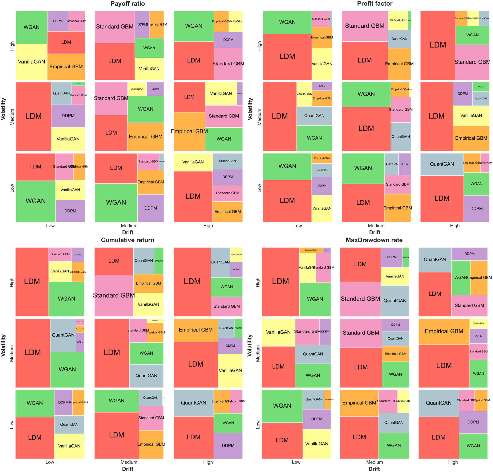
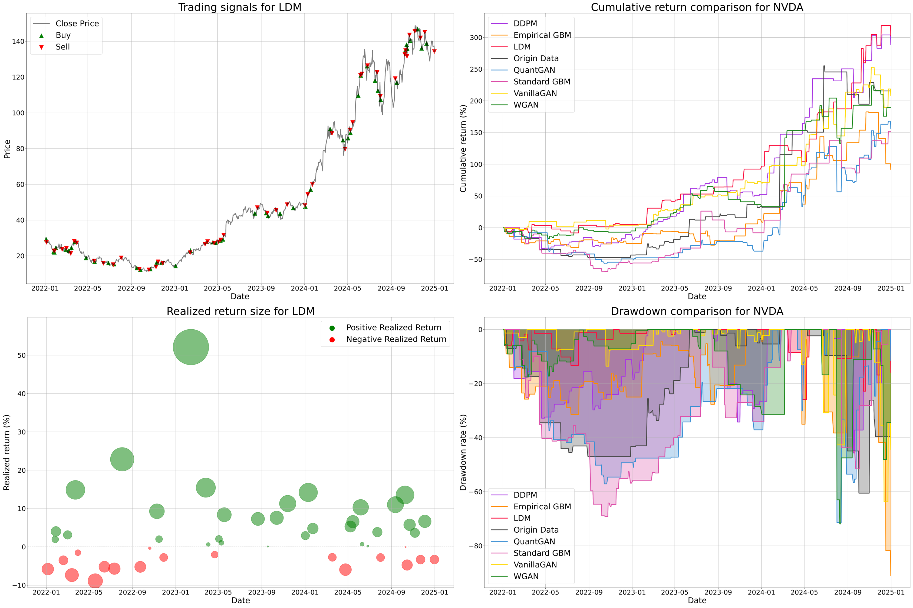

# Generative-GBM
Development of a Trading System Integrating Financial Engineering Models and Artificial Intelligence

## Concept of proposed trading system


## Financial Engineering Model - GBM


## Generative Model - Latent Diffusion Model


## 🛠 System
- **CPU** `AMD Ryzen 9 5950X 16-Core Processor`
- **GPU** `NVIDIA GeForce RTX 4080`
- **Memory RAM** `128GB`

**The computational efficiency of Generative-GBM is proportional to the CPU's power(Logical processor)**

## 📑 Usage
### Requirments
- **python version** `3.8`
- **TA Library** `TA_Lib-0.4.24-cp38-cp38-win_amd64.whl`
- **Other packages** `Packages in common_imports.py`

### run.py for data preparing & backtesting
- To run the system, the parser arguments must be passed using the `run.py` and `sh files`
- The `sh file` is divided into subfolders and multiple steps within the ./scripts/ folder.

#### The scripts folder structure is as follows:
```
./scripts/
├── 01_origin_data/
│     └──data_download.sh
│
├── 02_gbm/
│     └──GemerativeAI_gbm
│     │   ├──train_Diffusion.sh
│     │   ├──train_GAN.sh
│     │   └──   ...
│     │
│     └──Methematicl_gbm
│         └──   ...
│     
├── 03_stock_prediction/
│     ├──stock_prediction.sh
│     ├──backtesting.sh
│     └──   ...
```

#### Example command (Git Bash)
```
sh ./scripts/01_origin_data/data_download.sh
```
#### Example code in sh file
```
#!/bin/bash
python run.py \
    --task_name data_download \
    --metadata ./datasets/metadata_info.csv \
    --exp_root_path SP500 \
    --start_day 2019-01-01 \
    --end_day 2025-01-01 \
```

## 📊 Generative-GBM Scenario result 


## 📈 Backtesting 📉


#### Treemap


#### trading plot


#### XAI (Scenario Activation Rate)
